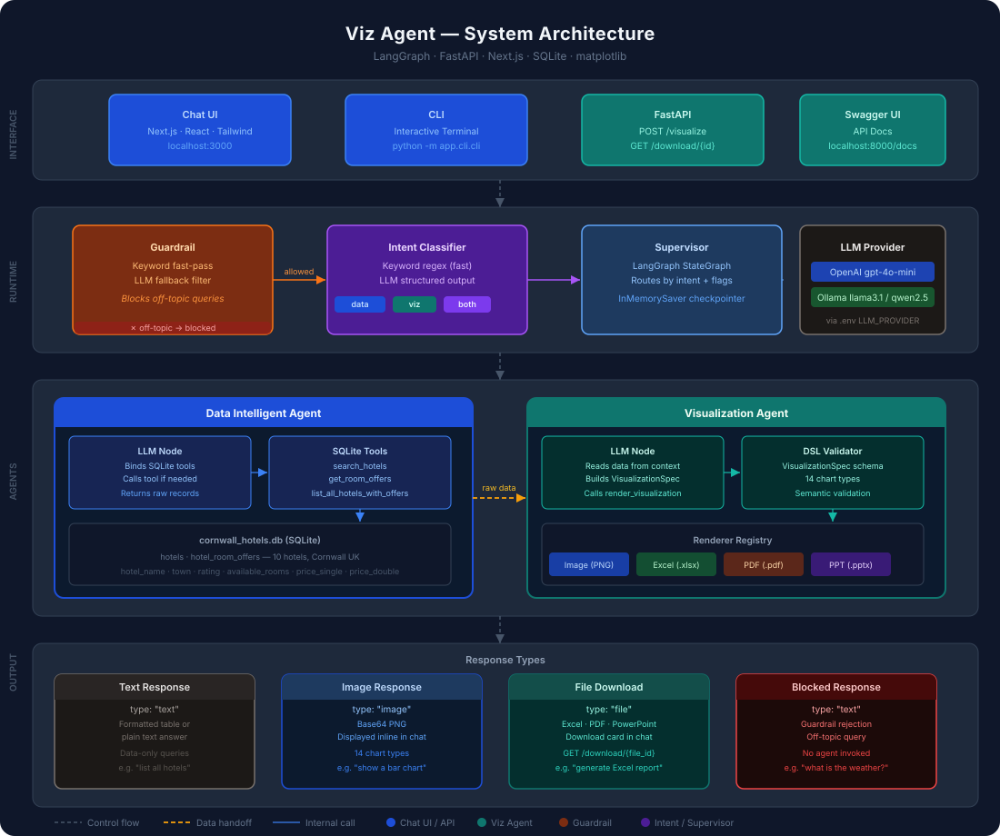

# Building a Multi-Agent Data Visualization System with LangGraph

*A practical guide to querying hotel data and generating charts, Excel files, PDFs, and PowerPoint presentations — all through a chat interface.*

---

## Overview

Imagine typing "show me a bar chart of hotel ratings by town" into a chat window and getting back an actual chart — not a link, not a description, but a rendered image right inside the conversation. Or asking "generate a PDF report of all hotels with pricing" and getting a download card with a fully formatted document.

That is exactly what this project does.

**Viz Agent** is a multi-agent AI system built on [LangGraph](https://github.com/langchain-ai/langgraph) that connects a natural language chat interface to a real SQLite hotel database. It understands what you are asking, fetches the right data, and renders the output in whatever format you need — inline image, Excel spreadsheet, PDF, or PowerPoint presentation.

The project is fully open source and runs locally. You can swap OpenAI for a local model via Ollama with a single environment variable change.

---

## High Level Architecture

The system is built around three core ideas: **intent classification**, **agent specialisation**, and **pluggable rendering**.



The diagram above shows the full system across four layers:

**Interface layer** — Users interact through a Next.js chat UI in the browser, a terminal CLI, or directly via the FastAPI REST endpoints. All three paths converge on the same runtime.

**Runtime layer** — Every message passes through a guardrail first. If the query is off-topic (weather, recipes, sports), it is rejected immediately without invoking any agent. Allowed messages go to the intent classifier, which decides whether the user wants data, a visualization, or both. The supervisor then orchestrates the agents accordingly.

**Agent layer** — Two specialised agents work in sequence when needed. The Data Agent queries the SQLite hotel database and returns structured records. For visualization requests, those records are handed to the Visualization Agent, which builds a chart specification and dispatches it to the appropriate renderer.

**Output layer** — The system returns one of four response types: a formatted text table for data queries, an inline PNG image for charts, a downloadable file (Excel, PDF, or PowerPoint) for export requests, or a rejection message for blocked queries.

### How the routing works

The intent classifier uses a two-layer approach — a fast keyword regex runs first with no LLM call, and only falls back to the LLM for genuinely ambiguous queries. This keeps latency low for the common cases.

| User says | Intent | Path | Response |
|-----------|--------|------|----------|
| "Which hotels in St Ives have rooms?" | `data` | Data Agent only | Text table |
| "Show me a bar chart of ratings" | `both` | Data Agent → Viz Agent | Inline PNG |
| "Generate an Excel report" | `both` | Data Agent → Viz Agent | Excel download |
| "What is the weather today?" | blocked | Guardrail | Rejection message |

---

## The Two Agents

### Data Intelligent Agent

The Data Agent is responsible for one thing: getting data from the database.

It has access to four tools that query a SQLite database of Cornwall hotels:

- **Search hotels** — filter by town and minimum rating
- **Get room offers** — pricing and availability for a specific hotel
- **List all hotels with offers** — full join used for chart data
- **Filter by price** — find hotels within a budget

When you ask a plain data question like *"which hotels in St Ives have rooms available?"*, the supervisor routes directly to this agent and returns a formatted text table. No chart is generated. No unnecessary LLM calls are made.

When a visualization is needed, this agent fetches the data first and passes it forward to the Visualization Agent.

### Visualization Agent

The Visualization Agent takes the data from the Data Agent and turns it into a visual output.

It supports **14 chart types** across **4 output formats**:

| Chart types | Output formats |
|-------------|---------------|
| Bar, Horizontal Bar, Stacked Bar, Grouped Bar | Image — inline PNG displayed in chat |
| Line, Area, Scatter, Pie, Donut | Excel — downloadable `.xlsx` file |
| Histogram, Heatmap, Bubble, Waterfall, Gauge | PDF — downloadable `.pdf` file |
| | PowerPoint — downloadable `.pptx` file |

The agent reads the user's request, picks the right chart type and output format, and calls a `render_visualization` tool. The renderer produces the output and returns it — the chat UI then displays it inline or as a download card.

---

## Cloning and Setting Up the Project

### Prerequisites

**Python 3.10+**

```bash
# Check your version
python --version

# Install Python from https://python.org if needed
```

**Node.js 18+**

```bash
# Check your version
node --version
npm --version

# Install Node.js from https://nodejs.org if needed
```

### Clone the repository

```bash
git clone https://github.com/arunvambur/building-agents.git
cd building-agents/viz-agent
```

### Install Python dependencies

```bash
pip install -e .
```

This installs everything in one step — LangGraph, FastAPI, matplotlib, openpyxl, reportlab, python-pptx, and all other dependencies declared in `pyproject.toml`.

### Install frontend dependencies

```bash
cd chat
npm install
cd ..
```

---

## Environment Variable Setup

Copy the example file and fill in your values:

```bash
cp .env.example .env
```

Open `.env` and choose your LLM provider.

**Option A — OpenAI (cloud, recommended for first run):**

```bash
LLM_PROVIDER=openai
OPENAI_API_KEY=your_openai_api_key_here
OPENAI_MODEL=gpt-4o-mini
```

Get your API key from [platform.openai.com](https://platform.openai.com).

**Option B — Ollama (local, no API key needed):**

```bash
LLM_PROVIDER=ollama
OLLAMA_MODEL=llama3.1:8b
OLLAMA_BASE_URL=http://localhost:11434
```

---

## Setting Up a Local Model with Ollama

If you prefer to run everything locally without an OpenAI account, Ollama makes it straightforward.

### 1. Install Ollama

Download and install from [ollama.com](https://ollama.com). Available for macOS, Linux, and Windows.

### 2. Pull a model

Not all models support tool calling, which this project requires. Use one of these confirmed working models:

```bash
# Recommended — good balance of speed and quality (~5GB)
ollama pull llama3.1:8b

# Alternative — excellent structured output (~5GB)
ollama pull qwen2.5:7b
```

> **Important:** `gemma3` does not support tool calling and will not work with this project.

### 3. Start Ollama

```bash
ollama serve
```

Ollama runs at `http://localhost:11434` by default. Set `OLLAMA_BASE_URL` in your `.env` if you change the port.

---

## Running the Project

You need two terminals open — one for the backend, one for the frontend.

### Terminal 1 — Backend API

```bash
cd src
python -m uvicorn app.api.api:app --reload --host 0.0.0.0 --port 8000
```

The API starts at `http://localhost:8000`. You can explore all endpoints interactively at `http://localhost:8000/docs`.

### Terminal 2 — Chat UI

```bash
cd chat
npm run dev
```

Open `http://localhost:3000` in your browser. The chat UI is ready.

---

## Using the Chat Interface

Once both services are running, open `http://localhost:3000`.

**Data queries — returns a formatted text table:**

```
Which hotels in St Ives have available rooms?
What is the cheapest hotel in Cornwall?
Find hotels with a rating above 4.5
List all hotels in Newquay
```

**Visualization queries — returns an inline chart:**

```
Show me a bar chart of hotel ratings by town
Generate a pie chart of room distribution
Plot a line chart of single room prices
Show a heatmap of ratings vs pricing
```

**File export queries — returns a download card:**

```
Generate an Excel report of all hotels with pricing
Create a PDF of hotel ratings by town
Make a PowerPoint presentation of the top rated hotels
Export hotel data to a spreadsheet
```

The system remembers your conversation within a session. You can ask follow-up questions and the context is preserved across turns.

---

## Using the CLI

If you prefer the terminal over the browser, the CLI gives you the same capabilities without the UI:

```bash
cd src
python -m app.cli.cli
```

Example session:

```
Viz Agent ready. Type 'exit' to quit.

You: which hotels in Falmouth have rooms?
Agent: hotel_name    | town     | rating | available_rooms | price_single
       Harbour Inn   | Falmouth | 4.2    | 2               | 95.0
       1 record(s) found.

You: show me a bar chart of ratings by town
Agent: data:image/png;base64,iVBORw0KGgo...

You: exit
```

Type `exit` to quit the session.

---

## What to Try First

Five prompts to get started in under two minutes:

1. `List all hotels in Cornwall` — see the full database as a text table
2. `Show me a bar chart of hotel ratings by town` — get an inline chart
3. `Which hotels have rooms available for under £120 per night?` — filtered data query
4. `Generate an Excel report of all hotels with pricing` — download a spreadsheet
5. `Show me a gauge of the average hotel rating` — KPI card visualization

---

## Project Repository

The full source code, including all agents, renderers, tests, and the chat UI, is available at:

**[github.com/arunvambur/building-agents](https://github.com/arunvambur/building-agents)**

The project is structured to be extended — adding a new chart type, a new data source, or a new renderer requires minimal changes to the existing code.
