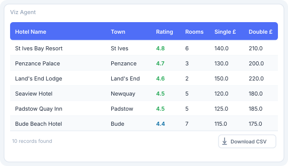
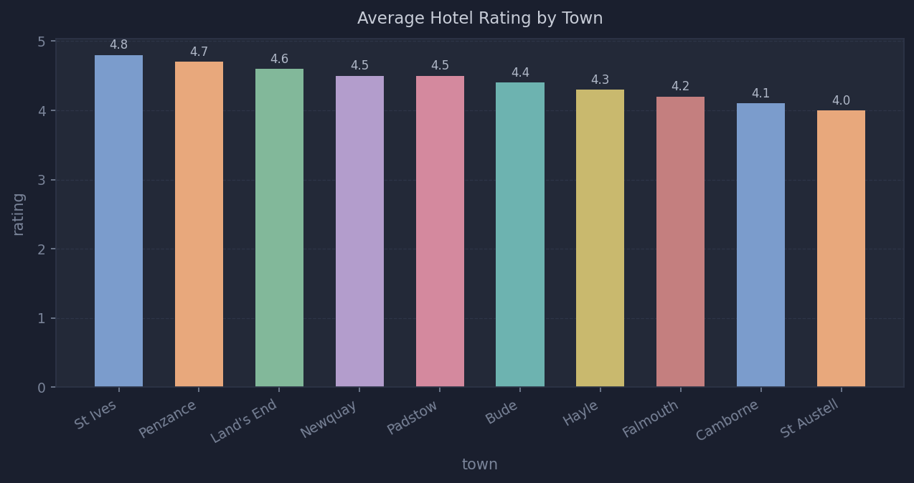
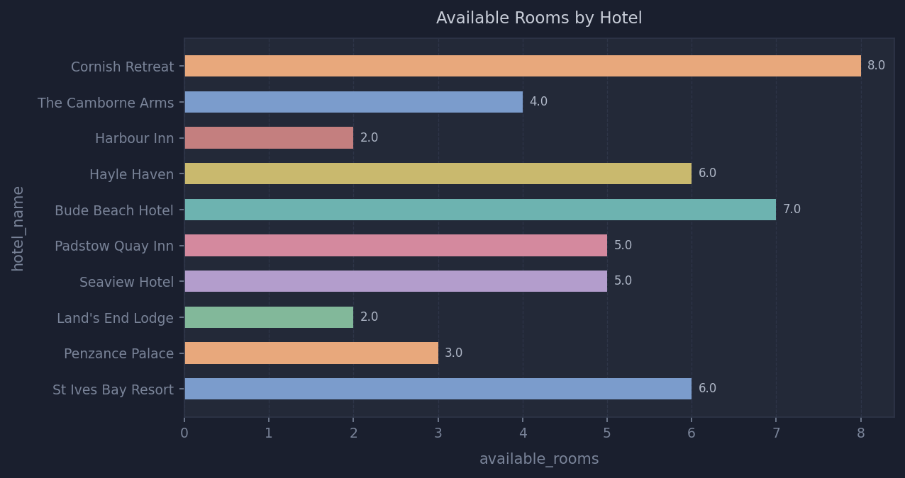
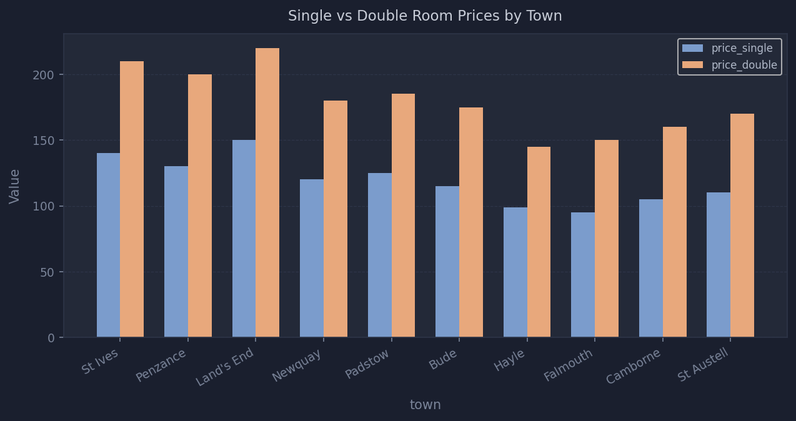
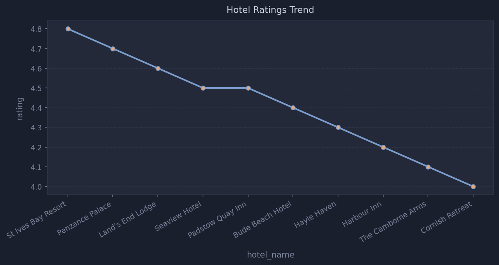
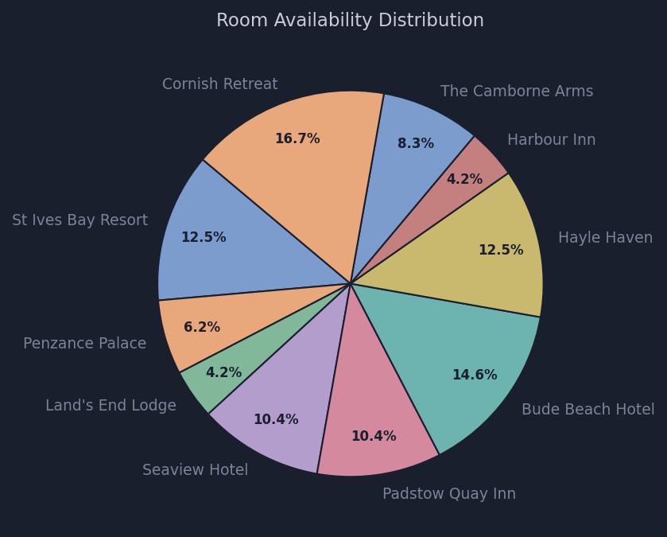
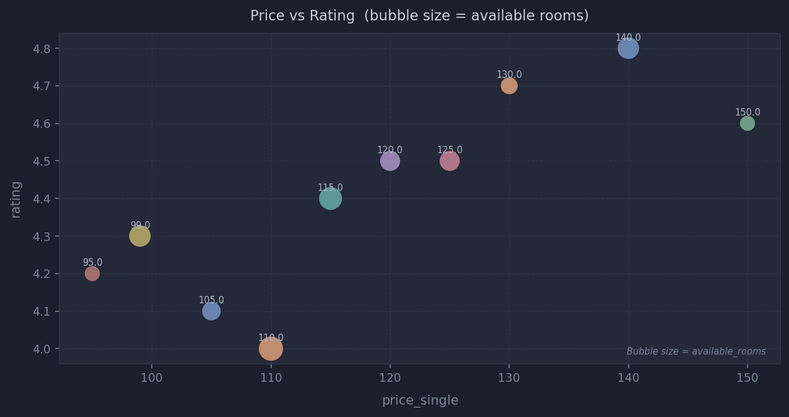
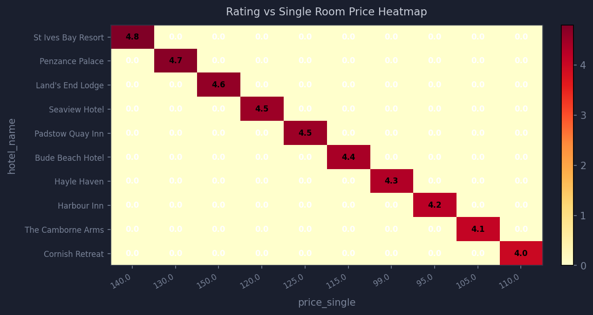
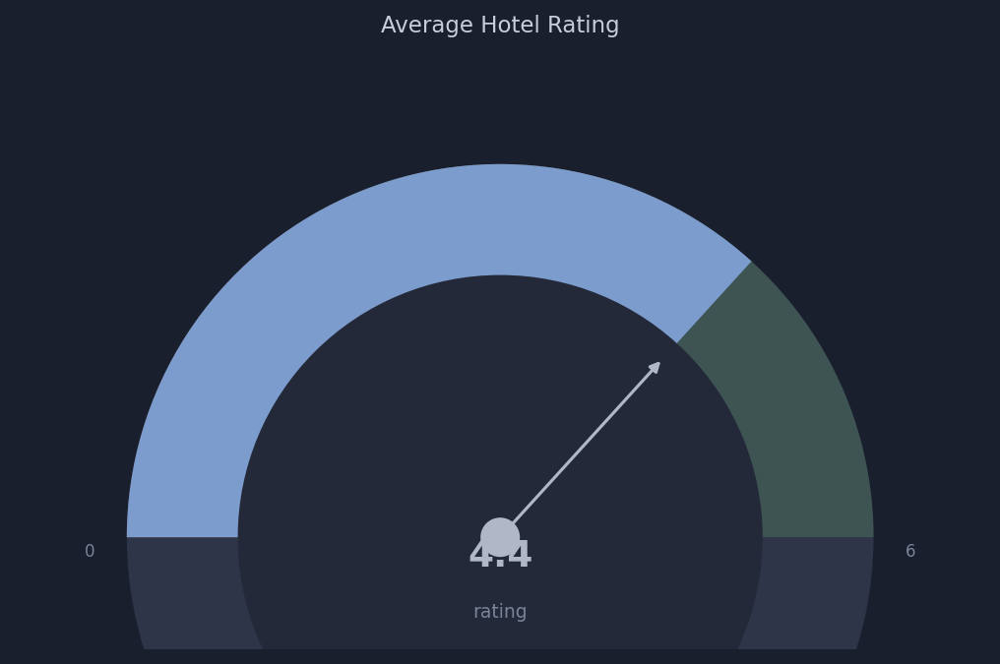

# Building a Multi-Agent Data Visualization System with LangGraph

*A practical guide to querying hotel data and generating charts, Excel files, PDFs, and PowerPoint presentations — all through a chat interface.*

---

## Overview

Imagine typing "show me a bar chart of hotel ratings by town" into a chat window and getting back an actual chart — not a link, not a description, but a rendered image right inside the conversation. Or asking "generate a PDF report of all hotels with pricing" and getting a download card with a fully formatted document.

That is exactly what this project does.

**Viz Agent** is a multi-agent AI system built on [LangGraph](https://github.com/langchain-ai/langgraph) that connects a natural language chat interface to a real SQLite hotel database. It understands what you are asking, fetches the right data, and renders the output in whatever format you need — inline image, Excel spreadsheet, PDF, or PowerPoint presentation.

The project is fully open source and runs locally. You can swap OpenAI for a local model via Ollama with a single environment variable change.

---

## High Level Architecture

The system is built around three core ideas: **intent classification**, **agent specialisation**, and **pluggable rendering**.


The diagram above shows the full system across four layers:

**Interface layer** — Users interact through a Next.js chat UI in the browser, a terminal CLI, or directly via the FastAPI REST endpoints. All three paths converge on the same runtime.

**Runtime layer** — Every message passes through a guardrail first. If the query is off-topic, it is rejected immediately without invoking any agent. Allowed messages go to the intent classifier, which decides whether the user wants data, a visualization, or both. The supervisor then orchestrates the agents accordingly.

**Agent layer** — Two specialised agents work in sequence when needed. The Data Agent queries the SQLite hotel database and returns structured records. For visualization requests, those records are handed to the Visualization Agent, which builds a chart specification and dispatches it to the appropriate renderer.

**Output layer** — The system returns one of four response types: a formatted sortable table for data queries, an inline PNG image for charts, a downloadable file (Excel, PDF, or PowerPoint) for export requests, or a rejection message for blocked queries.

### How the routing works

| User says | Intent | Path | Response |
|-----------|--------|------|----------|
| "Which hotels in St Ives have rooms?" | `data` | Data Agent only | Sortable table + CSV download |
| "Show me a bar chart of ratings" | `both` | Data Agent → Viz Agent | Inline PNG chart |
| "Generate an Excel report" | `both` | Data Agent → Viz Agent | Excel download card |
| "What is the weather today?" | blocked | Guardrail | Rejection message |

---

## The Two Agents

### Data Intelligent Agent

The Data Agent is responsible for one thing: getting data from the database and returning it as a clean, sortable table in the chat. It has access to four tools that query a SQLite database of Cornwall hotels:

- **Search hotels** — filter by town and minimum rating
- **Get room offers** — pricing and availability for a specific hotel
- **List all hotels with offers** — full join used for chart data
- **Filter by price** — find hotels within a budget

When you ask a plain data question like *"which hotels in St Ives have rooms available?"*, the supervisor routes directly to this agent and returns a formatted table. No chart is generated. No unnecessary LLM calls are made. You also get a **Download CSV** button on every table response.

### Visualization Agent

The Visualization Agent takes the data from the Data Agent and turns it into a visual output. It supports **14 chart types** across **4 output formats**:

| Chart types | Output formats |
|-------------|---------------|
| Bar, Horizontal Bar, Stacked Bar, Grouped Bar | Image — inline PNG displayed in chat |
| Line, Area, Scatter, Pie, Donut | Excel — downloadable `.xlsx` file |
| Histogram, Heatmap, Bubble, Waterfall, Gauge | PDF — downloadable `.pdf` file |
| | PowerPoint — downloadable `.pptx` file |

---

## Prerequisites

Before you start, make sure you have the following installed on your machine.

### Python 3.10 or higher

**Check if Python is already installed:**

```bash
python --version
```

If you see `Python 3.10.x` or higher, you are good. If not, download and install from [python.org](https://www.python.org/downloads/).

> **Windows users:** During installation, check the box that says **"Add Python to PATH"** before clicking Install.

---

### Node.js 18 or higher

**Check if Node.js is already installed:**

```bash
node --version
npm --version
```

If you see `v18.x.x` or higher, you are good. If not, download and install from [nodejs.org](https://nodejs.org/en/download).

---

### Git

**Check if Git is already installed:**

```bash
git --version
```

If not installed, download from [git-scm.com](https://git-scm.com/downloads).

---

## Step 1 — Clone the Repository

Open a terminal and run:

```bash
git clone https://github.com/arunvambur/building-agents.git
cd building-agents/viz-agent
```

You should now be inside the `viz-agent` folder. All subsequent commands run from this folder unless stated otherwise.

---

## Step 2 — Create a Python Virtual Environment

A virtual environment keeps the project's dependencies isolated from your system Python. This prevents version conflicts with other projects.

**Create the virtual environment:**

```bash
python -m venv .venv
```

This creates a `.venv` folder inside the project directory.

**Activate the virtual environment:**

On **macOS / Linux:**
```bash
source .venv/bin/activate
```

On **Windows (Command Prompt):**
```bash
.venv\Scripts\activate.bat
```

On **Windows (PowerShell):**
```bash
.venv\Scripts\Activate.ps1
```

> **PowerShell note:** If you get an error about execution policy, run this first:
> ```powershell
> Set-ExecutionPolicy -ExecutionPolicy RemoteSigned -Scope CurrentUser
> ```
> Then try activating again.

**Verify the virtual environment is active:**

Your terminal prompt should now show `(.venv)` at the start, like this:

```
(.venv) C:\Users\you\building-agents\viz-agent>
```

> **Important:** Every time you open a new terminal to work on this project, you must activate the virtual environment again before running any Python commands.

---

## Step 3 — Install Python Dependencies

With the virtual environment active, install all Python dependencies in one command:

```bash
pip install -e .
```

This installs everything declared in `pyproject.toml` — LangGraph, FastAPI, matplotlib, openpyxl, reportlab, python-pptx, and all other dependencies.

**Verify the installation:**

```bash
pip list | grep langgraph
```

You should see `langgraph` listed with a version number.

---

## Step 4 — Install Frontend Dependencies

```bash
cd chat
npm install
cd ..
```

This installs the Next.js, React, and Tailwind CSS packages for the chat UI.

---

## Step 5 — Set Up Environment Variables

Copy the example environment file:

**macOS / Linux:**
```bash
cp .env.example .env
```

**Windows (Command Prompt):**
```bash
copy .env.example .env
```

**Windows (PowerShell):**
```bash
Copy-Item .env.example .env
```

Now open `.env` in any text editor and choose your LLM provider.

---

### Option A — OpenAI (recommended for first run)

Get your API key from [platform.openai.com](https://platform.openai.com/api-keys) and set:

```bash
LLM_PROVIDER=openai
OPENAI_API_KEY=sk-your-key-here
OPENAI_MODEL=gpt-4o-mini
```

---

### Option B — Ollama (local, no API key needed)

If you prefer to run everything locally without an OpenAI account, use Ollama.

**Install Ollama** from [ollama.com](https://ollama.com) for your platform.

**Pull a model** — not all models support tool calling. Use one of these confirmed working models:

```bash
# Recommended — good balance of speed and quality (~5GB download)
ollama pull llama3.1:8b

# Alternative — excellent structured output (~5GB download)
ollama pull qwen2.5:7b
```

> **Important:** `gemma3` does not support tool calling and will not work with this project.

**Start Ollama:**

```bash
ollama serve
```

Leave this running in a separate terminal. Then set your `.env`:

```bash
LLM_PROVIDER=ollama
OLLAMA_MODEL=llama3.1:8b
OLLAMA_BASE_URL=http://localhost:11434
```

---

## Step 6 — Run the Backend API

Open a terminal, navigate to the project root, activate the virtual environment, then:

```bash
cd src
python -m uvicorn app.api.api:app --reload --host 0.0.0.0 --port 8000
```

You should see output like:

```
INFO:     Uvicorn running on http://0.0.0.0:8000 (Press CTRL+C to quit)
INFO:     Started reloader process
INFO:     AgentRuntime initialised — agents: ['data_agent', 'viz_agent']
```

The API is now running at `http://localhost:8000`.

You can explore all endpoints interactively at `http://localhost:8000/docs`.

> **Keep this terminal open.** The backend must stay running while you use the chat UI.

---

## Step 7 — Run the Chat UI

Open a **second terminal**, navigate to the project root, then:

```bash
cd chat
npm run dev
```

You should see:

```
▲ Next.js 14.x.x
- Local: http://localhost:3000
- Ready in Xs
```

Open `http://localhost:3000` in your browser. The chat interface is ready.

---

## Step 8 — Verify Everything is Working

Open the chat at `http://localhost:3000` and try these four prompts in order. Each one tests a different part of the system.

---

### Prompt 1 — Data Table

Type this into the chat:

```
List all hotels in Cornwall
```

**What you should see:** A sortable table showing all 10 hotels with their town, rating, room availability, and pricing. Click any column header to sort. A **Download CSV** button appears at the bottom right.



---

### Prompt 2 — Bar Chart

```
Show me a bar chart of hotel ratings by town
```

**What you should see:** An inline bar chart rendered directly in the chat bubble, showing the average rating for each town with value labels on each bar.



---

### Prompt 3 — Horizontal Bar Chart

```
Horizontal bar chart of available rooms by hotel
```

**What you should see:** A horizontal bar chart — better for long hotel names — showing room availability per hotel.



---

### Prompt 4 — Grouped Bar Chart

```
Show a grouped bar chart comparing single and double room prices by town
```

**What you should see:** Side-by-side bars for each town comparing single room price (blue) against double room price (orange).



---

### Prompt 5 — Line Chart

```
Line chart of hotel ratings across all hotels
```

**What you should see:** A connected line chart with markers showing how ratings vary across hotels, with a filled area beneath the line.



---

### Prompt 6 — Pie Chart

```
Pie chart of room availability by hotel
```

**What you should see:** A pie chart showing each hotel's share of total available rooms, with percentage labels on each slice.



---

### Prompt 7 — Bubble Chart

```
Bubble chart of rating vs price where bubble size is available rooms
```

**What you should see:** A scatter plot where each hotel is a bubble — the X axis is single room price, Y axis is rating, and the bubble size represents the number of available rooms. Each hotel is labelled.



---

### Prompt 8 — Heatmap

```
Heatmap of hotel ratings vs single room price by hotel
```

**What you should see:** A 2D colour matrix with hotels on the Y axis and price on the X axis. Darker cells indicate higher values. Each cell is annotated with its value.



---

### Prompt 9 — Gauge / KPI

```
Show me a gauge of the average hotel rating
```

**What you should see:** A semicircular gauge with colour zones (red → yellow → green), a needle pointing to the average rating, and the value displayed in the centre.



---

### Prompt 10 — Excel Export

```
Generate an Excel report of all hotels with pricing
```

**What you should see:** A download card in the chat with a green Excel icon, the filename, and a click-to-download link. The file contains a styled data table and an embedded bar chart.

---

If all ten prompts work as shown, your setup is complete and fully functional.

---

## Using the CLI (Optional)

If you prefer the terminal over the browser, the CLI gives you the same capabilities:

```bash
# Make sure your virtual environment is active and you are in the project root
cd src
python -m app.cli.cli
```

Example session:

```
Viz Agent ready. Type 'exit' to quit.

You: which hotels in Falmouth have rooms?
Agent: hotel_name  | town     | rating | available_rooms | price_single
       Harbour Inn | Falmouth | 4.2    | 2               | 95.0
       1 record(s) found.

You: show me a bar chart of ratings by town
Agent: data:image/png;base64,...

You: exit
```

Type `exit` to quit the session.

---

## Quick Reference — All Commands

### Every time you start working

```bash
# 1. Navigate to the project
cd building-agents/viz-agent

# 2. Activate the virtual environment
source .venv/bin/activate          # macOS / Linux
.venv\Scripts\activate.bat         # Windows Command Prompt
.venv\Scripts\Activate.ps1         # Windows PowerShell
```

### Terminal 1 — Backend

```bash
cd src
python -m uvicorn app.api.api:app --reload --host 0.0.0.0 --port 8000
```

### Terminal 2 — Frontend

```bash
cd chat
npm run dev
```

### Terminal 3 — Ollama (only if using local model)

```bash
ollama serve
```

Then open `http://localhost:3000`.

---

## Troubleshooting

**`uvicorn` is not recognised**

Run it as a Python module instead:
```bash
python -m uvicorn app.api.api:app --reload --host 0.0.0.0 --port 8000
```

**`(.venv)` is not showing in my prompt**

You forgot to activate the virtual environment. Run the activate command for your platform from Step 2.

**`pip install -e .` fails**

Make sure the virtual environment is active (you should see `(.venv)` in your prompt) and that you are in the `viz-agent` folder, not inside `src`.

**The chat UI shows "API error 504"**

The backend is taking too long. This usually happens on the first request when the LLM is cold-starting. Wait 30 seconds and try again.

**Ollama model not found**

Make sure you pulled the model before starting:
```bash
ollama pull llama3.1:8b
```

**PowerShell execution policy error**

```powershell
Set-ExecutionPolicy -ExecutionPolicy RemoteSigned -Scope CurrentUser
```

---

## What to Try Next

Once everything is running, here are more prompts to explore the full feature set:

**Data queries:**
```
Find hotels with a rating above 4.5
Which hotels have a double room under £160?
What is the cheapest hotel in Cornwall?
Show me room pricing for all hotels
```

**More charts:**
```
Stacked bar chart of single vs double room prices by hotel
Donut chart of hotel distribution by town
Waterfall chart of single room prices across hotels
Show a histogram of hotel ratings
```

**File exports:**
```
Create a PDF of hotel ratings by town
Make a PowerPoint presentation of hotel data
Export all hotel data to CSV
```

---

## Project Repository

The full source code is available at:

**[github.com/arunvambur/building-agents](https://github.com/arunvambur/building-agents)**
